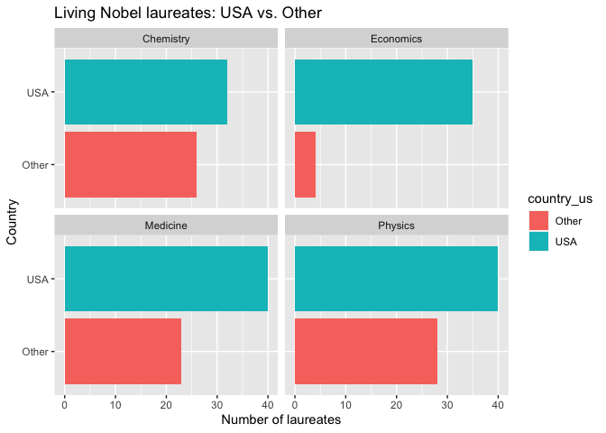
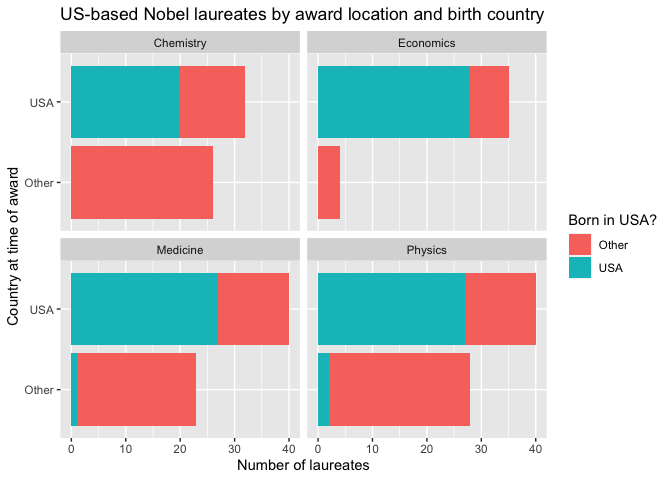

Lab 03 - Nobel laureates
================
Insert your name here
Insert date here

### Load packages and data

``` r
library(tidyverse) 
library(dplyr)
```

``` r
nobel <- read_csv("data/nobel.csv")
```

## Exercises

Here is a link to the [lab
instructions](https://datascience4psych.github.io/DataScience4Psych/lab03.html).

### Exercise 1

``` r
nrow(nobel)
```

    ## [1] 935

``` r
ncol(nobel)
```

    ## [1] 26

The dataset contains 935 observations and 26 variables. Each row
represents a single Nobel Prize laureate.

### Exercise 2

``` r
nobel_living <- nobel %>%
  filter(
    is.na(died_date),
    !is.na(country),
    gender != "org"
  )
```

The nobel_living dataset contains 228 observations.

### Exercise 3

``` r
nobel_living <- nobel_living %>%
  mutate(
    country_us = if_else(country == "USA", "USA", "Other")
  )

nobel_living_science <- nobel_living %>%
  filter(category %in% c("Physics", "Medicine", "Chemistry", "Economics"))
```

``` r
nobel_living_science %>%
  ggplot(aes(x = country_us, fill = country_us)) +
  geom_bar() +
  facet_wrap(~ category) +
  coord_flip() +
  labs(
    x = "Country",
    y = "Number of laureates",
    title = "Living Nobel laureates: USA vs. Other"
  ) 
```

<!-- -->

### Exercise 4

``` r
nobel_living_science <- nobel_living_science %>%
  mutate(
    born_country_us = ifelse(born_country_original == "USA", "USA", "Other")
  )
sum(nobel_living_science$born_country_us == "USA")
```

    ## [1] 105

105 winners are born in the U.S.

### Exercise 5

…

``` r
ggplot(data = nobel_living_science, aes(x = country_us, fill = born_country_us)) +
  geom_bar() +
  facet_wrap(~ category) +
  coord_flip() +
  labs(
    x = "Country at time of award",
    y = "Number of laureates",
    fill = "Born in USA?",
    title = "US-based Nobel laureates by award location and birth country"
  )
```

<!-- -->

The visualization supports BuzzFeed’s claim. Although not the majority,
a substantial number of Nobel laureates were based in the U.S. at the
time of award, and are not bron in the U.S.

### Exercise 6

``` r
nobel_living_science %>%
  filter(
    country == "USA",
    born_country != "USA",
    !is.na(born_country)
  ) %>%
  count(born_country) %>%
  arrange(desc(n))
```

    ## # A tibble: 21 × 2
    ##    born_country       n
    ##    <chr>          <int>
    ##  1 Germany            7
    ##  2 United Kingdom     7
    ##  3 China              5
    ##  4 Canada             4
    ##  5 Japan              3
    ##  6 Australia          2
    ##  7 Israel             2
    ##  8 Norway             2
    ##  9 Austria            1
    ## 10 Finland            1
    ## # ℹ 11 more rows

Germany and the UK is the most common.
